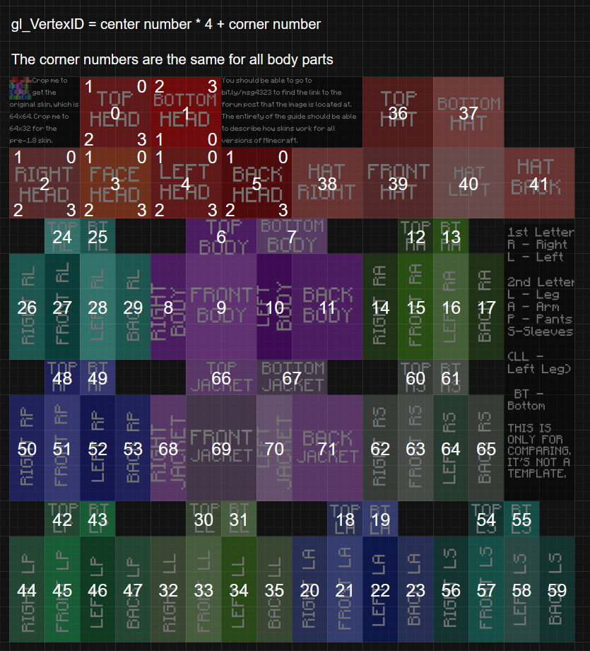

# Structure
The extmodel format is encoded as RGB of specific pixels on a minecraft 64x64 skin .png image.
More specifically the data is encoded in the top left pixels.

All alpha in the data sections must 0xFF (full opaque, no transparency).

Each pixel is decoded into 3 bytes which are used for different purposes depending on location

### What data exists at what pixel coordinates:
```
                        1 1 1 1 1 1 1 1 1 1 2 2 2 2 2 2 2 2 2 2 3 3
 X  0 1 2 3 4 5 6 7 8 9 0 1 2 3 4 5 6 7 8 9 0 1 2 3 4 5 6 7 8 9 0 1
Y  ----------------------------------------------------------------
0 | G               . . . . . . . . . . . . . . . . T T T T T T T T
1 | I I I I I I I I . . . . . . . . . . . . . . . . T T T T T T T T
2 | I I I I I I I I . . . . . . . . . . . . . . . . T T T T T T T T
3 | I I I I I I I I . . . . . . . . . . . . . . . . T T T T T T T T
4 | T T T T T T T T . . . . . . . . . . . . . . . . T T T T T T T T
5 | T T T T T T T T . . . . . . . . . . . . . . . . T T T T T T T T
6 | T T T T T T T T . . . . . . . . . . . . . . . . T T T T T T T T
7 | T T T T T T T T . . . . . . . . . . . . . . . . T T T T T T T T
```

`G`: Global Flags
`F`: Face Operation
`T`: Transform Data
`.`: Used by MC

# G (Global Flags)
Global flags describe extmodel properties that apply to the whole model
```c
       byte | R | G | B | A |
explanation |   e   | t | - |
```
### e - Enabled
Must be `0xDA67`

### t - skin type
Wide (Steve): `0x00`
Slim (Alex): `0x01`

# I (Tranform Index)
Each transform index describes which (if any) transform should be applied to that face.
Each of the 72 faces of a player model has a corresponing byte in `I` that controls it.

```c
       byte | R | G | B | A | R | G | B | A  ...
explanation |i_0|i_1|i_2| - |i_3|i_4|i_5| -  ...
```

The byte stores an index to the transform stored in `T`, with the following exception:
`i_n == 0xFF` ⇒ This face has no transforms.

The following image showcases where the different Face IDs are located 

### Reference C code for getting finding the correct byte given the face ID:
```c
uint8_t lookupIndex(uint8_t faceid) {
    uint32_t rgbaIndex = faceId % 3;
    uint32_t pixelIndex = faceId / 3;
    uint32_t x = (pixelIndex + 8) % 8;
    uint32_t y = (pixelIndex + 8) / 8;
    return 0xFF & (PIXEL_FETCH(x, y) << pixelIndex);
}
```

# T (Transforms)
Transforms constists of A header followed by an amount of modifier data

Each transform uses all 4 bytes of a pixel.

```c
           |     Transform Header     |    Transform Data     ...
      bit  |  R   |  G   |  B   |  A  |  R  |  G  |  B  |  A  ...
explanation|T_next|T_size|T_type|  -  |<depends on type>|  -  ...
```

### Reference C code for getting finding the correct RGBA bytes given a Tranform Index
```c
uint32_t lookupTransformBytes(uint8_t transformIndex) {
    uint32_t temp = 32 + transformIndex;
    uint32_t x = temp % 8;
    uint32_t y = temp / 8;
    if (y >= 8) {
        x += 24;
        y -= 8;
    }
    return PIXEL_FETCH(x, y);
}
```

## T_next (Next Transform)
Index of the next transform to apply. (Identical to Transform Index in `I`.)

Should be `0xFF` if there is no more transform

## T_size (Transform Data Size)
How many consequtive RGB bytes are required for this transformation.

## T_type (Transform Type)
What type of transformation to apply to face

```c
0: TRANSFROM_TYPE_DISPLACEMENT;
1: TRANSFROM_TYPE_UV_CROP;
2: TRANSFROM_TYPE_UV_OFFSET;
3: TRANSFROM_TYPE_SPECIAL;
```

## Transform Data
Transform varies data depends on the

### TRANSFROM_TYPE_DISPLACEMENT
```c
        bit |  R7  |  R6  |  R5  |  R4  |  R3  |  R2  |  R1  |  R0  |
explanation | sign | snap |           global_displacement           |

        bit |  G7  |  G6  |  G5  |  G4  |  G3  |  G2  |  G1  |  G0  |
explanation |a_sign|a_spec|      a_displacement/a_special_mode      |

        bit |  B7  |  B6  |  B5  |  B4  |  B3  |  B2  |  B1  |  B0  |
explanation |                                         |   a_edge    |


sign:
    //Direction of global displacement
    case 0: positive
    case 1: negative

global_displacement:
    // size, (in half pixels) of displacement

snap:
    // if displacement should snap to opposing layer before apply transform
    // Eg: move an outer layer so it lines up with inner layer
    // NOTE: this kinda changes pixel size as well
    case 0: disable
    case 1: enable

// ==============================================
// "a_" stands for assymetric_
// Assymetric Displacement is a displacement that
//   is applied to one edge of a face's vertexes.

a_sign:
    //Direction of assymetric displacement
    case 0: positive
    case 1: negative

a_spec:
    // if a special assymetric transform should be used instead of a_displacement
    case 0: disable
    case 1: enable

a_displacement:
    // size, (in half pixels) of displacement

a_special_mode:
    case 0: ASYMETRIC_SPECIAL_FLIP_OUTER
    case 1: ASYMETRIC_SPECIAL_FLIP_INNER

a_edge:
    // Assymetric Edge: Which edge should be assymtrically transformed
    case 0: top
    case 1: bottom
    case 2: right
    case 3: left
```

### TRANSFROM_TYPE_UV_CROP
```c
        bit |  R7  |  R6  |  R5  |  R4  |  R3  |  R2  |  R1  |  R0  |
explanation |         crop_bot          |         crop_top          |

        bit |  G7  |  G6  |  G5  |  G4  |  G3  |  G2  |  G1  |  G0  |
explanation |         crop_right        |         crop_left         |

        bit |  B7  |  B6  |  B5  |  B4  |  B3  |  B2  |  B1  |  B0  |
explanation |                                         |snap_y|snap_x|

crop_bot / crop_top / crop_right / crop_left:
    // How many pixels to skip rendering that edge

snap_x:
    // Scales and crops the texture width-wise so that pixels are as big as the opposing layers pixels
    // If snapping the primary layer to the secondary this will crop away the left & right most pixels
snap_y:
    // same as snap_x but for height

```
### TRANSFROM_TYPE_UV_OFFSET
```c
        bit |  R7  |  R6  |  R5  |  R4  |  R3  |  R2  |  R1  |  R0  |
explanation |  uv_y_min_0 |                uv_x_max                 |

        bit |  G7  |  G6  |  G5  |  G4  |  G3  |  G2  |  G1  |  G0  |
explanation |  uv_y_min_1 |                uv_x_min                 |

        bit |  B7  |  B6  |  B5  |  B4  |  B3  |  B2  |  B1  |  B0  |
explanation |  uv_y_min_2 |                uv_y_max                 |
```

Reference C code to read/write `uv_y_min`
```c
uint8_t getCropLeft(uint8_t r, uint8_t g, uint8_t b) {
    uint8_t mask = 0b11000000;
    return ((r & mask) >> 2) | ((g & mask) >> 4) | ((b & mask) >> 6);
}
void writeCropLeftToRGB(uint8_t cropLeft, uint8_t* r, uint8_t* g, uint8_t* b) {
    uint8_t mask = 0b11000000;
    *r |= mask & (crop_left << 6);
    *g |= mask & (crop_left << 4);
    *b |= mask & (crop_left << 2);
}
```

### TRANSFROM_TYPE_SPECIAL
```c

| R0 | rainbow

other fields are unused
```